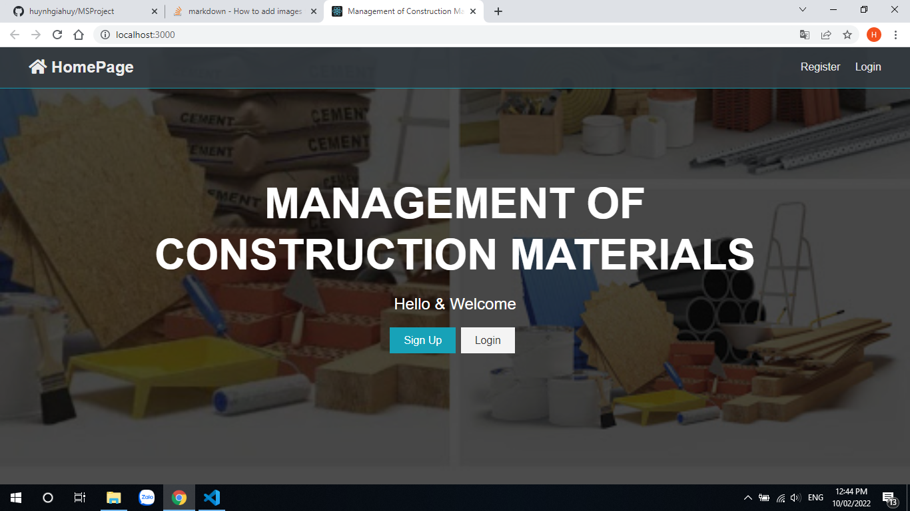
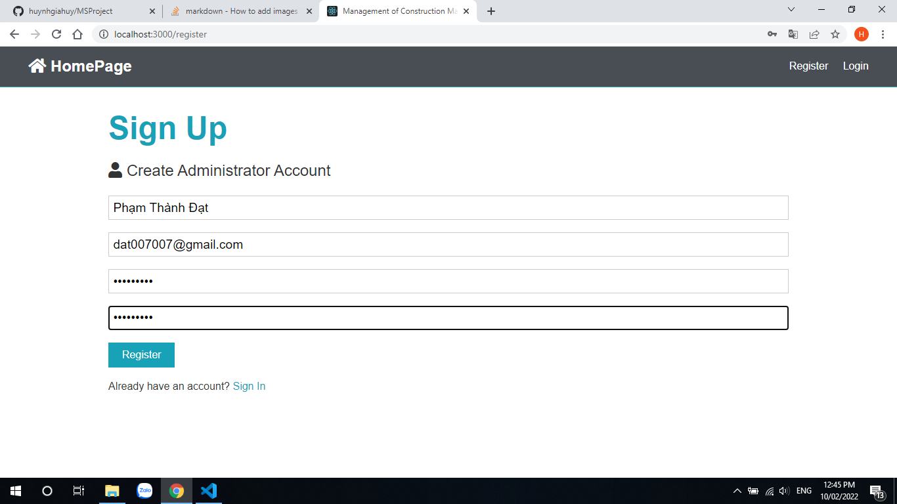
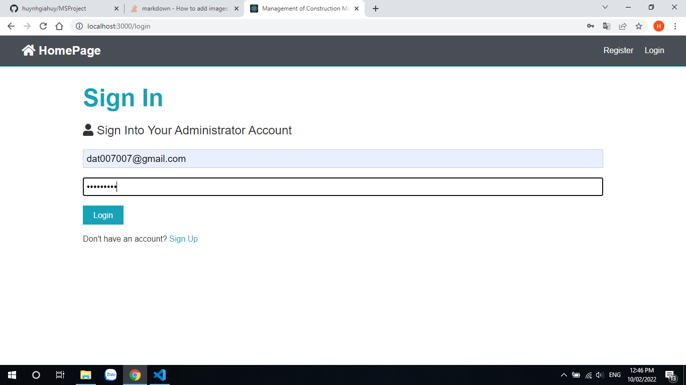
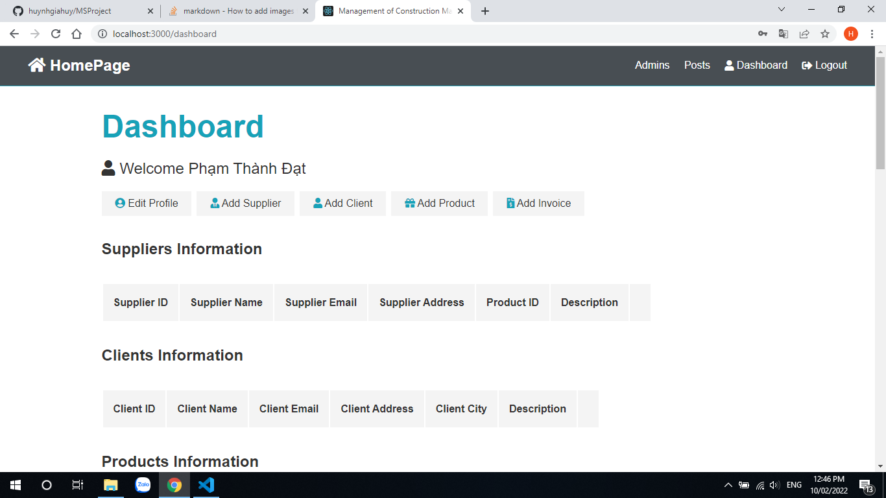
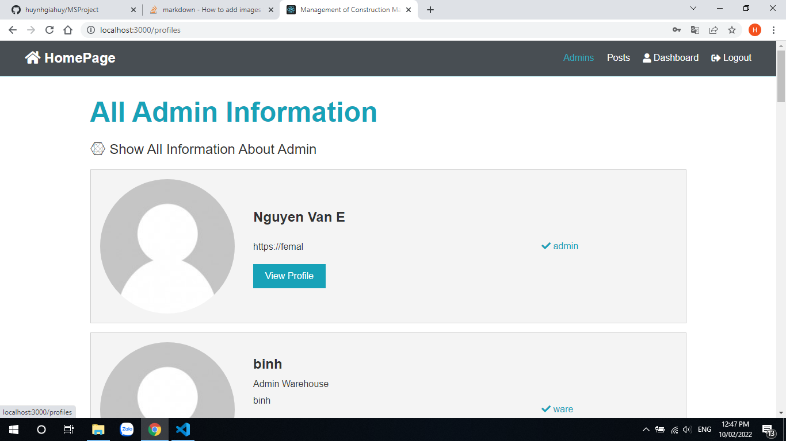
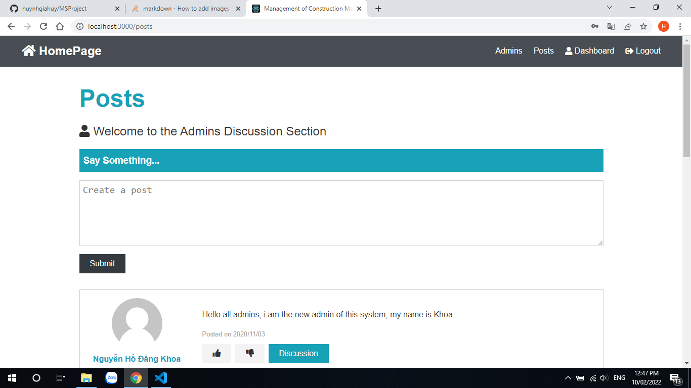

This is my first MEARN Stack Project with Teams (3 members)\
\
**How to run Project:**
1. Run "npm install" in both client and server folder to install modules.
2. Run "npm run dev" to active both client and server.
3. The Server will run at port 5000.
4. Wait few seconds for Project running. \
\
**Project Demo Images:**

# Landing Page
\

# SignUp Page
\

# SignIn Page
\

# Dashboard Page
\

# Admins Page
\

# Posts Page
\

